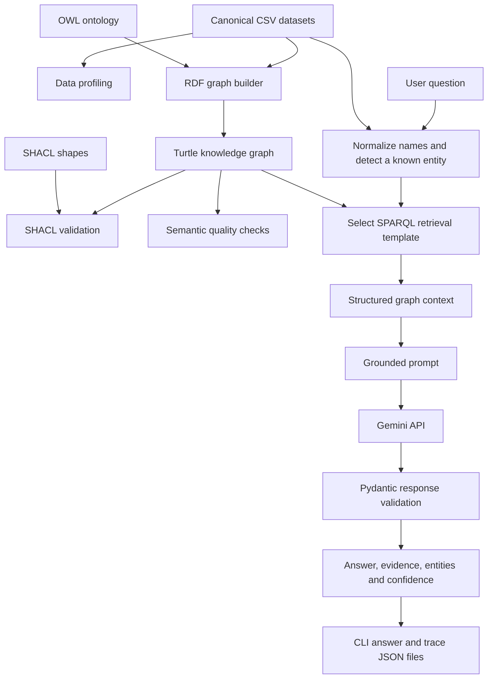
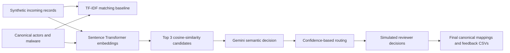
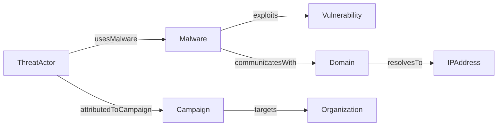

# Cybersecurity Threat Graph-RAG

A Python learning project for building a cybersecurity knowledge graph, validating its data, resolving entity names, and generating answers grounded in retrieved graph evidence. It combines **RDF/OWL, SPARQL, SHACL, entity matching, Gemini, and FastAPI**.

The included actors, malware, vulnerabilities, campaigns, and infrastructure form a demonstration dataset. Their relationships are examples for learning, not verified real-world threat intelligence.

## Contents

- [Architecture](#architecture)
- [Knowledge graph model](#knowledge-graph-model)
- [Project structure](#project-structure)
- [Setup](#setup)
- [Run Graph-RAG](#run-graph-rag)
- [Build and validate the graph](#build-and-validate-the-graph)
- [Entity matching and review](#entity-matching-and-review)
- [Local API](#local-api)
- [Evaluation](#evaluation)
- [Outputs and traceability](#outputs-and-traceability)
- [Troubleshooting](#troubleshooting)
- [Security and current limitations](#security-and-current-limitations)

## Architecture

### Graph construction and question answering



The graph lives in a local Turtle file and is loaded into an in-memory RDFLib graph. There is no external graph database or vector database in the implemented runtime. Profiling and validation are separate scripts; they are not automatic gates executed before every question.

Question answering works as follows:

1. Load canonical names from the raw CSV files.
2. Normalize the question and names by removing non-alphanumeric characters and lowercasing. For example, `APT-29`, `APT 29`, and `APT29` normalize similarly.
3. Choose the longest matching known name in the question.
4. Run a specialized multi-hop SPARQL query for a threat actor or malware entity. Other supported catalog types use a generic outgoing-neighborhood query.
5. Supply the question, canonical entity, and retrieved context to Gemini, with instructions to use only that evidence.
6. Validate the structured response with Pydantic and return the answer, evidence, entities used, evidence status, and confidence.

The command-line workflow separates retrieval and generation into two scripts connected by a JSON file. The FastAPI service implements retrieval and generation directly in `src/api/main.py`; it does not run the CLI scripts or read their saved answer.

### Separate entity-matching workflow



This workflow demonstrates how incoming names can be mapped to canonical entities. Its embedding search is **not currently used by the Graph-RAG question detector**. Review decisions are simulated in code; the feedback files do not automatically retrain a model or update the RDF graph.

## Knowledge graph model

The ontology uses the namespace `http://example.org/cybersecurity/` and seven main entity classes:

| Class | Source file | Example |
|---|---|---|
| ThreatActor | `data/raw/threat_actors.csv` | APT-29 |
| Malware | `data/raw/malware.csv` | SolarDrop |
| Vulnerability | `data/raw/vulnerabilities.csv` | CVE-2026-1001 |
| Campaign | `data/raw/campaigns.csv` | Operation Nightfall |
| Organization | `data/raw/organizations.csv` | FinBank Ltd |
| Domain | `data/raw/domains.csv` | secure-update-example.com |
| IPAddress | `data/raw/ip_addresses.csv` | 192.0.2.10 |

`data/raw/relationships.csv` connects entity IDs. The RDF builder translates these relationships into ontology properties:



The sample APT-29 path connects SolarDrop to CVE-2026-1001 (CVSS 9.8), `secure-update-example.com`, and `192.0.2.10`. A separate actor-to-campaign relationship connects APT-29 to Operation Nightfall. These are graph assertions, not external claims about the real actor.

## Project structure

```text
data/
  raw/                          Canonical entities and relationships
  processed/                    Incoming entity candidates
  rdf/                          Main graph and deliberately invalid example
ontology/                       OWL classes and properties
shapes/                         SHACL constraints
queries/                        Example SPARQL investigation query
src/
  create_dataset.py             Generate demonstration CSV data
  profile_data.py               Profile datasets and relationship references
  test_ontology.py              Inspect the ontology
  build_rdf_graph.py            Combine ontology and CSV instances into RDF
  run_sparql_queries.py         Run example graph investigations
  validate_shacl.py             Validate graph structure and field constraints
  create_invalid_graph.py       Create a separate invalid graph for learning
  semantic_validation.py        Check graph-level consistency and completeness
  entity_resolution.py          TF-IDF entity-matching baseline
  vector_candidate_retrieval.py Embedding-based candidate retrieval
  gemini_semantic_mapping.py    Gemini-assisted canonical mapping
  human_review_feedback.py      Simulated review and feedback export
  gemini_config.py              Shared Gemini client and error formatting
  graphrag/
    graph_retrieval.py           CLI question-to-evidence retrieval
    graphrag_answer.py           CLI evidence-to-answer generation
    evaluate_graphrag.py         Labeled retrieval evaluation
  api/main.py                   FastAPI service
outputs/                        Generated reports and traces; ignored by Git
.env.example                    Credential-free configuration template
.gitignore                      Local secrets and artifact exclusions
requirements.txt                Python dependencies
```

Core libraries include pandas for tabular data, RDFLib for RDF and SPARQL, pySHACL for validation, scikit-learn for TF-IDF matching, sentence-transformers for embeddings, google-genai for Gemini, Pydantic for response schemas, and FastAPI/Uvicorn for HTTP serving.

## Setup

The project has been run with Python 3.13 on Windows. The commands below use PowerShell and should be run from the repository root. Access to this private repository is required to clone it.

```powershell
git clone https://github.com/eixilmayur-create/cybersecurity-threat-graphrag.git
cd cybersecurity-threat-graphrag
python -m venv .venv
.\.venv\Scripts\python.exe -m pip install -r requirements.txt
Copy-Item .env.example .env
```

Copy the template only on first setup; preserve an existing `.env`. Edit `.env` locally:

```dotenv
GEMINI_API_KEY=your_own_api_key
GEMINI_MODEL=gemini-3.5-flash-lite
```

Do not commit a real key. Shared configuration loads the project-root `.env` with `override=True`, so values in that file override existing process environment values.

| Setting | Current behavior |
|---|---|
| `GEMINI_API_KEY` | Required for Gemini generation and for API startup |
| `GEMINI_MODEL` | Used by `gemini_config.py`; default is `gemini-3.5-flash-lite` |
| `AWS_REGION`, `NEPTUNE_ENDPOINT`, `GCP_PROJECT_ID` | Template placeholders; not required for the local RDF workflow |

`graphrag_answer.py` and `gemini_semantic_mapping.py` use the shared Gemini configuration, including a 60-second HTTP timeout. **The API currently hardcodes `gemini-2.5-flash-lite` and does not honor `GEMINI_MODEL`.** That older model returned a 404 during local diagnosis; `/ask` needs its model configuration aligned before relying on live generation. This does not prevent the documentation or retrieval endpoints from working when the API starts successfully.

## Run Graph-RAG

The repository includes sample CSVs and a built RDF graph, so a first run does not require regenerating the dataset.

```powershell
.\.venv\Scripts\python.exe src/graphrag/graph_retrieval.py --question "What malware, vulnerabilities, infrastructure and campaigns are associated with APT-29?"
.\.venv\Scripts\python.exe src/graphrag/graphrag_answer.py
```

The first command writes `outputs/graphrag/retrieved_graph_context.json`. The second reads that file, calls Gemini, and saves the answer and trace. Rerun retrieval whenever the question or graph changes: the answer script does not refresh evidence itself.

Without `--question`, retrieval uses its built-in SolarDrop question. A malware context does not include the actor's campaign path, so use the actor question above when you want Operation Nightfall included.

An illustrative answer supported by the sample graph is:

> APT-29 uses SolarDrop. SolarDrop exploits CVE-2026-1001 and communicates with secure-update-example.com, which resolves to 192.0.2.10. APT-29 is also associated with Operation Nightfall.

Actual model wording and confidence can vary. The response fields are:

| Field | Meaning |
|---|---|
| `answer` | Natural-language answer grounded in the supplied context |
| `evidence` | Supporting facts expressed as strings |
| `entities_used` | Entities used in the answer |
| `confidence` | Model-reported evidence completeness, between 0 and 1; not a calibrated probability |
| `evidence_status` | `SUFFICIENT`, `PARTIAL`, or `INSUFFICIENT` |
| `generation_status` | CLI generation outcome: `SUCCESS` or `FAILED` on the generation path |

If retrieval has no usable context, the CLI saves an insufficient-evidence fallback without calling Gemini. On a generation exception, it saves the fallback and a secret-redacted diagnostic in the trace, marks generation as failed, and exits with code 1. The early retrieval-failure branch has a smaller output schema and does not write a new trace; do not interpret an older trace as belonging to that run.

## Build and validate the graph

To inspect and rebuild from the existing CSVs:

```powershell
.\.venv\Scripts\python.exe src/profile_data.py
.\.venv\Scripts\python.exe src/test_ontology.py
.\.venv\Scripts\python.exe src/build_rdf_graph.py
.\.venv\Scripts\python.exe src/run_sparql_queries.py
.\.venv\Scripts\python.exe src/validate_shacl.py
.\.venv\Scripts\python.exe src/semantic_validation.py
```

- **Profiling** checks missing values, duplicates, IDs, relationship types, and broken source/target references.
- **Ontology inspection** examines the schema used to describe the entities and relationships.
- **RDF construction** loads the ontology and canonical CSV data and serializes the combined graph to Turtle.
- **SPARQL examples** demonstrate entity lookup and multi-hop threat investigations.
- **SHACL validation** checks requirements such as required fields, cardinality, ID formats, allowed severity values, CVSS bounds, and relationship target classes.
- **Semantic validation** checks orphan entities, absent campaign targets, missing domain/IP mappings, severity/CVSS consistency, and incomplete investigation paths.

`src/create_dataset.py` regenerates the demonstration CSVs and can overwrite local data edits. It is optional for a fresh clone. `src/create_invalid_graph.py` creates the separate `cybersecurity_knowledge_graph_invalid.ttl` example; the validation script normally reads the main graph, so testing the invalid example requires intentionally changing its selected input.

## Entity matching and review

Run these optional learning stages in order:

```powershell
.\.venv\Scripts\python.exe src/entity_resolution.py
.\.venv\Scripts\python.exe src/vector_candidate_retrieval.py
.\.venv\Scripts\python.exe src/gemini_semantic_mapping.py
.\.venv\Scripts\python.exe src/human_review_feedback.py
```

The first stage creates synthetic incoming records and a TF-IDF matching report. Vector retrieval uses `sentence-transformers/all-MiniLM-L6-v2` and cosine similarity to return the top three candidates from canonical actors and malware. The embedding model may need downloading on first use.

Gemini then evaluates the candidates and routes decisions by confidence. The final script applies simulated reviewer decisions and exports final mappings, feedback, and a review summary. It is a demonstration of a review process, not a deployed analyst interface.

## Local API

```powershell
.\.venv\Scripts\python.exe -m uvicorn src.api.main:app --host 127.0.0.1 --port 8000
```

Keep the server process running while using the API. Open [Swagger documentation](http://127.0.0.1:8000/docs) or [OpenAPI JSON](http://127.0.0.1:8000/openapi.json). Startup loads the CSV catalog, RDF graph, and Gemini client. Restart after changing the source graph or configuration.

| Method | Route | Purpose |
|---|---|---|
| GET | `/` | Service metadata and documentation link |
| GET | `/health` | Loaded graph status, triple count, and whether a key is configured |
| GET | `/entity/{entity_name}` | Canonical entity lookup; returns 404 when not found |
| POST | `/retrieve` | Entity detection and graph context retrieval |
| POST | `/ask` | Retrieval followed by Gemini answer generation |

Both POST routes accept a JSON object with a `question` string of at least three characters:

```powershell
$body = @{ question = "What malware, vulnerabilities, infrastructure and campaigns are associated with APT-29?" } | ConvertTo-Json
Invoke-RestMethod -Uri "http://127.0.0.1:8000/retrieve" -Method Post -ContentType "application/json" -Body $body
```

After resolving the API model setting described under Setup, use the same request body with `/ask` for generation. `/retrieve` returns `question`, `status`, `detected_entity`, and `graph_context`. `/ask` returns `question`, `detected_entity`, `answer`, `evidence`, `entities_used`, `confidence`, and `evidence_status`.

Retrieval statuses are `SUCCESS`, `ENTITY_NOT_FOUND`, and `NO_CONTEXT` in the API. `/ask` returns an insufficient-evidence response when retrieval fails and HTTP 502 when Gemini generation raises an exception. `/health` confirms configuration and graph loading; it does **not** make a live Gemini call or verify model access. API requests do not automatically produce the CLI trace files.

## Evaluation

```powershell
.\.venv\Scripts\python.exe src/graphrag/evaluate_graphrag.py
```

The evaluator uses a labeled set of questions, expected canonical IDs, and expected facts. It measures entity detection correctness and fact coverage by matching expected strings against retrieved context. Its `end_to_end_success` means correct entity detection plus complete expected-fact retrieval.

Despite the broader descriptions in its comments, this script does **not** call Gemini or score generated answers. It is a retrieval regression check, not a measurement of LLM factuality, hallucination rate, or production readiness. No benchmark score is claimed here.

## Outputs and traceability

| Location | Contents |
|---|---|
| `outputs/` | Data profiling reports |
| `outputs/validation/` | SHACL text and RDF reports |
| `outputs/validation/semantic_validation_*.csv` | Semantic rule details and summary |
| `outputs/entity_resolution/` | TF-IDF resolution results |
| `outputs/vector_search/` | Candidate similarity results |
| `outputs/gemini_mapping/` | Gemini mapping decisions |
| `outputs/human_review/` | Review results, canonical mappings, feedback, summary |
| `outputs/graphrag/retrieved_graph_context.json` | Question, detected entity, retrieval status, evidence rows |
| `outputs/graphrag/graphrag_answer.json` | CLI structured answer |
| `outputs/graphrag/graphrag_trace.json` | Timestamp, model, retrieved context, answer, generation status/error |
| `outputs/evaluation/` | Evaluation details and summary CSVs |

Outputs are generated locally and ignored by Git. Most scripts write fixed filenames, so subsequent runs replace previous results; archive results separately if you need run history.

## Troubleshooting

| Symptom | What to check |
|---|---|
| Browser refuses `127.0.0.1:8000` | Start Uvicorn from the repository root and keep it running; inspect startup errors. |
| `ModuleNotFoundError` | Install requirements into `.venv` and use that environment's Python. |
| Missing API key | Create `.env` from the template and set `GEMINI_API_KEY` locally. The API checks this at startup. |
| Missing context JSON | Run `graph_retrieval.py` before `graphrag_answer.py`. |
| Answer concerns a previous question | Regenerate context with `--question`; generation reads the saved context. |
| Operation Nightfall is absent | Retrieve the APT-29 actor context; the malware template does not include campaign evidence. |
| Gemini 404 / model unavailable | Check the selected model. Shared-config scripts use `GEMINI_MODEL`; the API currently has a separate hardcoded value. |
| Gemini quota, permission, or timeout error | Check the diagnostic and account configuration; retry transient failures. Do not repeatedly retry quota failures. |
| `/health` passes but `/ask` fails | Health does not test Gemini access. Check the API model, key permissions, quota, and generation error. |
| SHACL or semantic checks fail | Inspect the generated reports and correct the source data or relationships, then rebuild the graph. |

## Security and current limitations

- `.env`, environment variants, private-key files, local credentials, virtual environments, caches, logs, generated outputs, and historical backup files are excluded from Git. `.env.example` contains placeholders only. Ignore rules are a safeguard, not a substitute for reviewing staged changes.
- Gemini receives the question and retrieved graph context; semantic mapping sends candidate context. Use only data approved for processing by that external service.
- The API has no authentication or authorization layer. Bind it to `127.0.0.1` for local use. Private GitHub repository visibility controls source access; it does not secure a separately deployed API.
- Retrieval is deterministic name matching, with one selected entity per question. It is not general natural-language-to-SPARQL generation or embedding-based question retrieval. IP addresses are graph nodes but are not included in the current name-detection catalog.
- SPARQL queries use canonical IDs from the catalog. Treat modifications to source catalogs as trusted-data changes and review them before use.
- Prompts request grounded answers and Pydantic validates response structure, but there is no automatic proof that every generated sentence follows from the graph. Review evidence for consequential use.
- CLI retrieval, API retrieval, and evaluation have separate implementations and can diverge. The API model configuration is one known example.
- The graph is loaded in memory, outputs use shared filenames, dependencies are not pinned, and several scripts execute work at import time. The project is intended for local learning rather than concurrent production workloads.
- No cloud database integration, deployed frontend, live threat-feed ingestion, automated model training, or production deployment is included.
